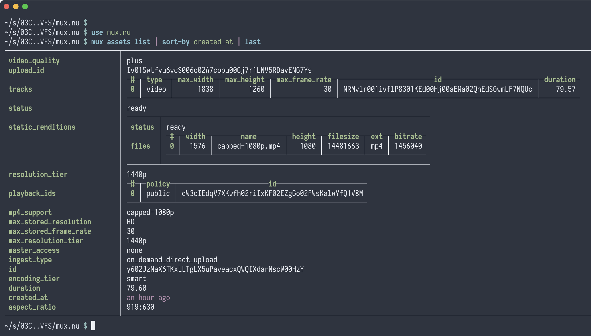

# mux.nu

[Nushell](https://www.nushell.sh/) wrapper for
[mux](https://docs.mux.com/api-reference)'s API.

## Endpoints Currently Supported

`https://api.mux.com/video/v1/`

| Nu Command     | API Endpoint           | HTTP Method | Description                        |
| -------------- | ---------------------- | ----------- | ---------------------------------- |
| `assets list`  | `/assets`              | `GET`       | Fetches a list of assets           |
| `upload start` | `/uploads`             | `POST`      | Starts a new video upload          |
| `upload list`  | `/uploads`             | `GET`       | Fetches a list of uploads          |
| `upload info`  | `/uploads/{upload_id}` | `GET`       | Retrieves upload info by upload ID |
| `upload put`   | `/{upload_url}`        | `PUT`       | Uploads a file to the provided URL |
